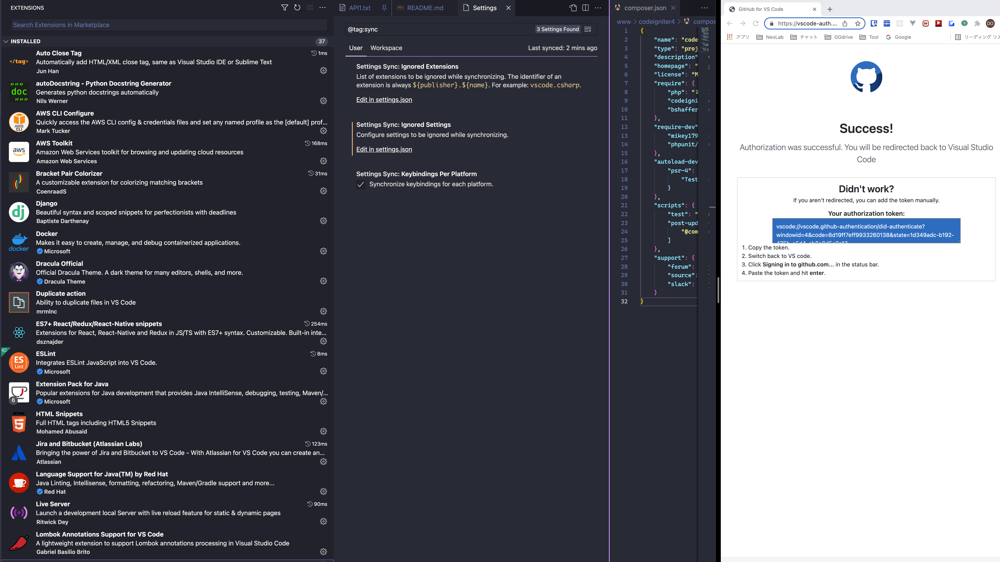
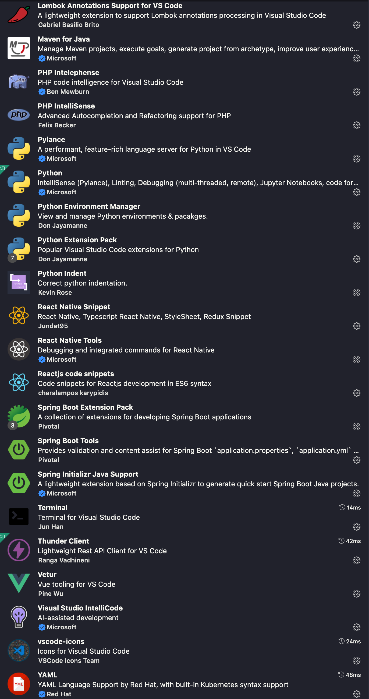
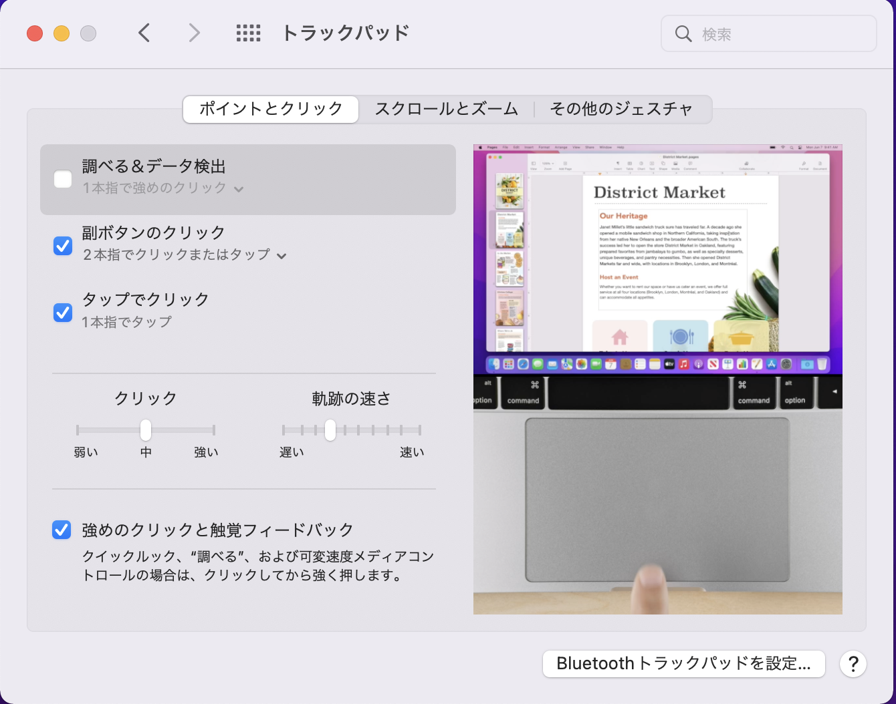
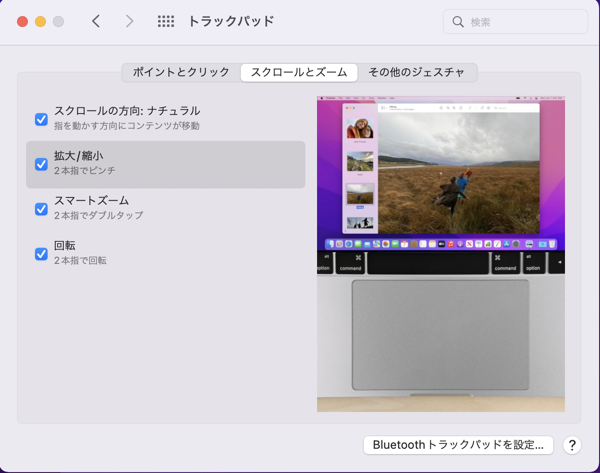
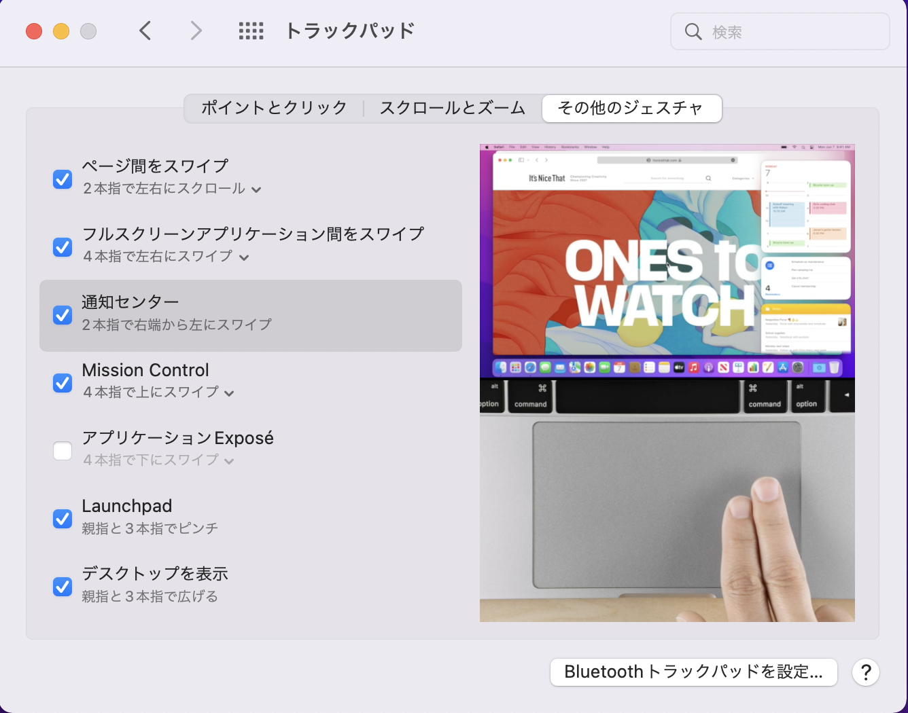
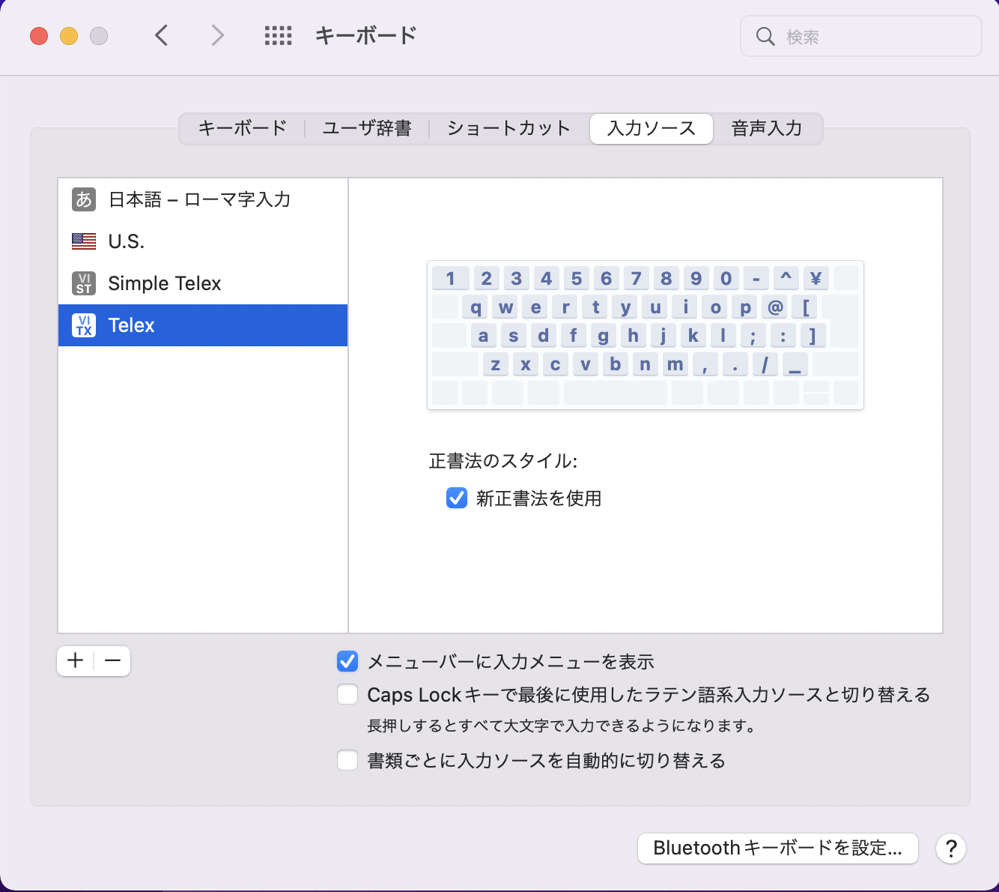

# nocode-macos-vscode-setting 🐳

## vscode
- login acc: tquangdo(github)

- extensions list:

## macos
1. ### drag pad
    
    ---
    
    ---
    
1. ### keyboard
    
1. ### shortcut
    - show file .env, .gitignore...: `cmd + shift + .`
    - finder search: `cmd + shift + G`
    - create new folder: `cmd + shift + N`
    - chrome fullscreen: `cmd + shift + F`
    - reset zoom chrome inspection: `ctrl + zero`
    - save screenshot: `shift ＋ command ＋ 3/4`
    - delete tam thoi/vinh vien: `cmd (+ alt) + del`
    - empty recycle bin: `cmd + shift + del`
    - focus on chrome's URL: `cmd + L`
1. ### terminal
    - list type of terminal: `cat /etc/shells` -> `terminal/etc_shells.sh`
    - check what type of terminal is default: `echo $SHELL` -> `/bin/zsh`
    - make color for terminal, customize zsh cmd...: `cat ~/.zshrc` -> `terminal/.zshrc`
1. ### others
    - delete MACOSX in "file.zip": `zip -d file.zip __MACOSX/\*`