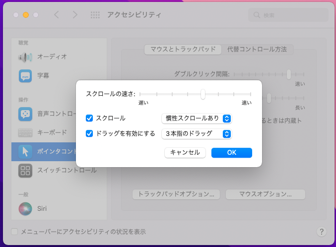

# nocode-macos-vscode-setting 🐳


[](https://github.com/tquangdo/nocode-macos-vscode-setting/issues/new)

## vscode
1. ### login & sync & pull push
    - login acc: tquangdo(github)
    
    - extensions list:
    
    > ⚠️⚠️⚠️ IMPORTANT!!! ⚠️⚠️⚠️ if ERR "Error when syncing to github acc"
    ```shell
    git clone <one repo!!!>
    git config --global user.name tquangdo
    git config --global user.email trangia61@gmail.com
    ```
    - edit 1 place and `git push` => just sync OK only after push OK!
1. ### "cascadia" font
    - [refer](https://github.com/microsoft/cascadia-code/wiki/Installing-Cascadia-Code)
    - `~/Library/Application Support/Code/User/settings.json` edit
    ```json
    "editor.fontLigatures": true,
    ...
    "editor.fontFamily": "cascadia code",
    "terminal.integrated.fontFamily": "cascadia code"
    ```

## macos
1. ### drag pad
    
    ---
    
    ---
    
    ---
    
1. ### keyboard
    
1. ### shortcut
    - show file .env, .gitignore...: `cmd + shift + .`
    - finder search: `cmd + shift + G`
    - create new folder: `cmd + shift + N`
    - chrome fullscreen: `cmd + shift + F`
    - reset zoom chrome inspection: `ctrl + zero`
    - save screenshot: `shift ＋ command ＋ 3/4`
    - delete tam thoi/vinh vien: `cmd (+ alt) + del`
    - empty recycle bin: `cmd + shift + del`
    - focus on chrome's URL: `cmd + L`
    - crop image in "Preview": `cmd + K`
    - show info file in "Finder": `cmd + I`
1. ### terminal
    - list type of terminal: `cat /etc/shells` -> `terminal/etc_shells.sh`
    - check what type of terminal is default: `echo $SHELL` -> `/bin/zsh`
    - make color for terminal, customize zsh cmd...: `cat ~/.zshrc` -> `terminal/.zshrc`
1. ### others
    - delete MACOSX in "file.zip": `zip -d file.zip __MACOSX/\*`
    - check port 5000:
    ```shell
    lsof -i tcp:5000
    =>
    COMMAND     PID       USER   FD   TYPE             DEVICE SIZE/OFF NODE NAME
    ControlCe 23203 NC00011462   16u  IPv4 0xb0b1a2b35fd40ca9      0t0  TCP *:commplex-main (LISTEN)
    ```
    - OR
    ```shell
    netstat -vanp tcp | grep 5000
    =>
    tcp6       0      0  *.5000                 *.*                    LISTEN      131072 131072  23203      0 0x0100 0x00000006
    tcp4       0      0  *.5000                 *.*                    LISTEN      131072 131072  23203      0 0x0100 0x00000006
    ```
